# Session Test Module

This module demonstrates stateful agent interactions using Google's Agent Development Kit (ADK).

## Architecture Diagram

## Overview

This module demonstrates how to:
1. Create stateful agents that maintain user preferences
2. Use the `output_key` feature to automatically save agent responses to session state
3. Implement tools that can read from and write to session state
4. Delegate tasks to specialized sub-agents